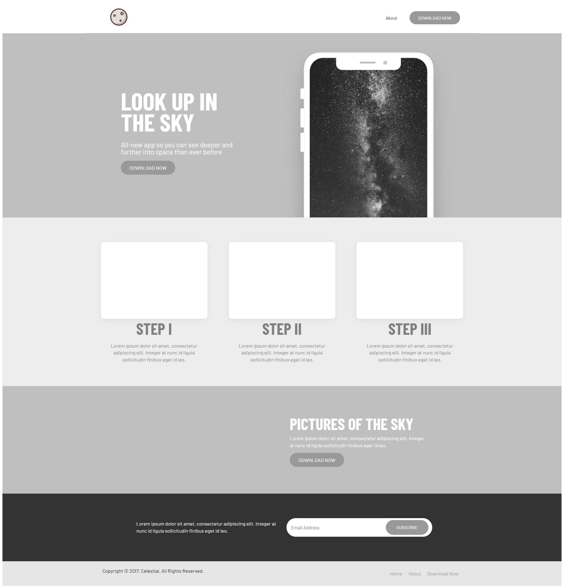
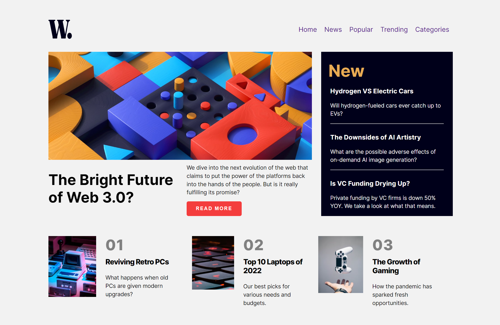
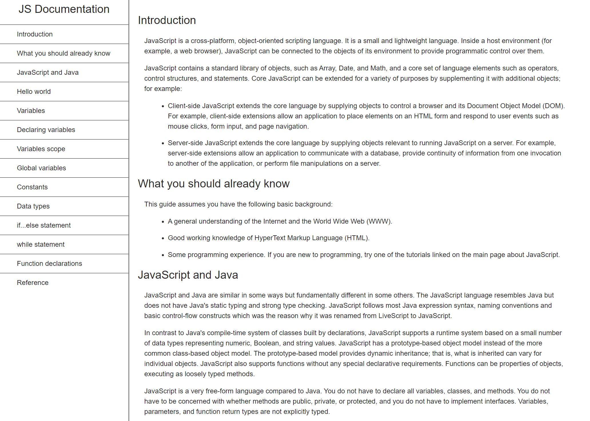
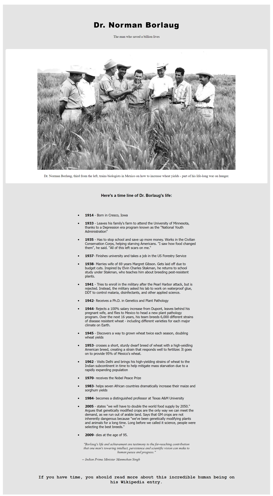
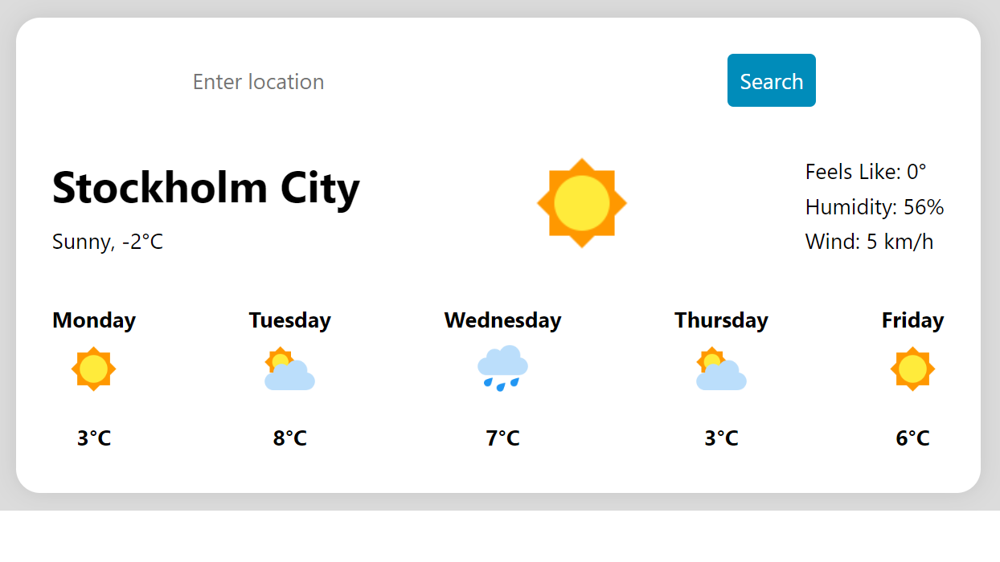
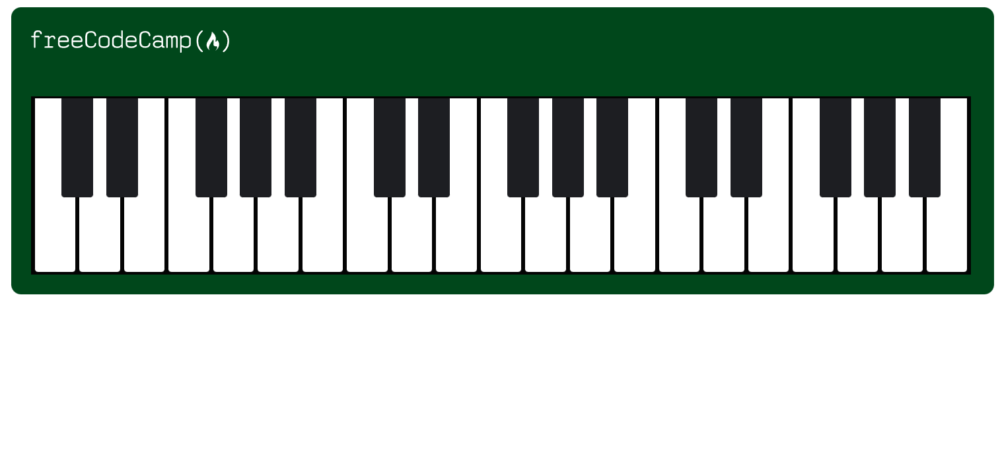
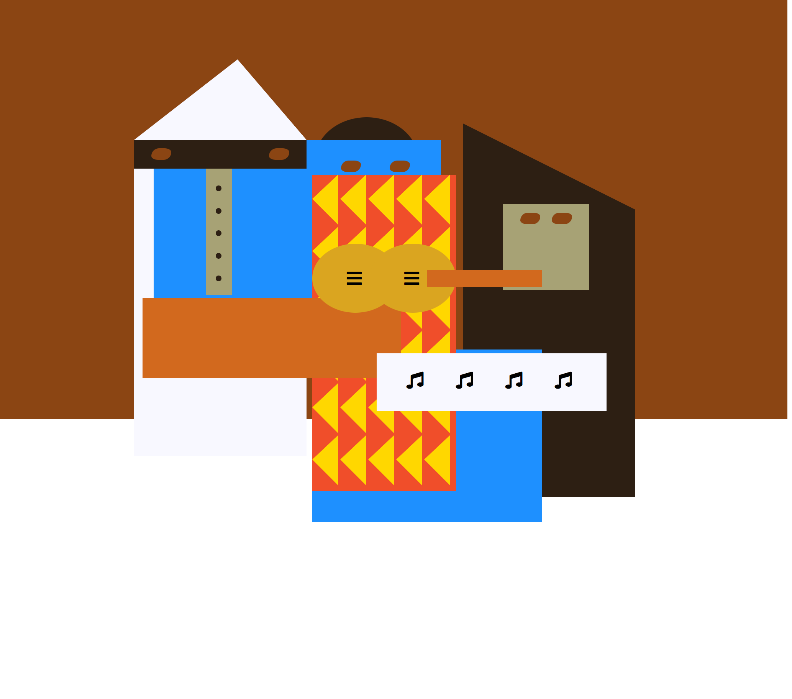
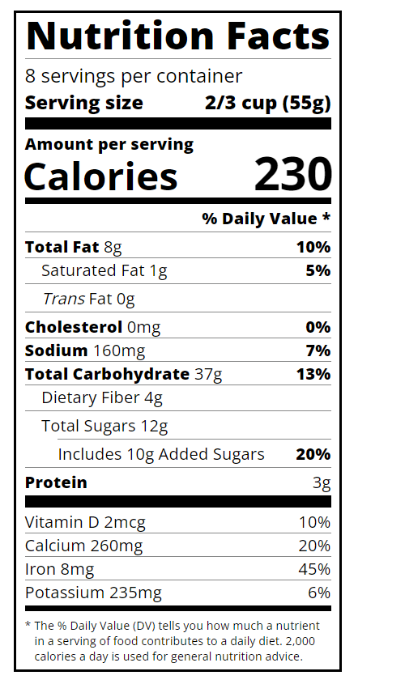
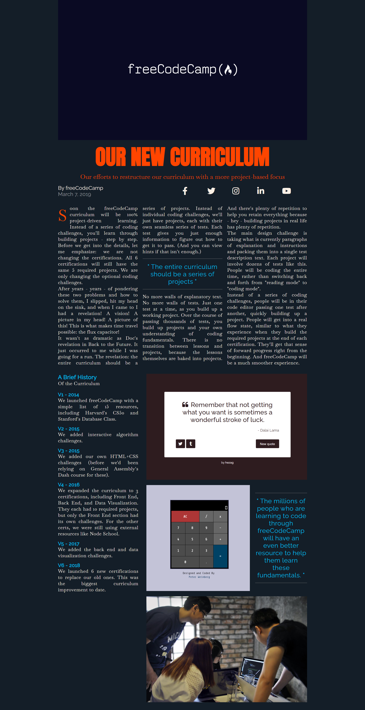

# Practice
Some basic exercises for web frontend development

## App download page

## News homepage

## JS Documentation

## A Tribute page of Dr.Norman
 

## Weather widget

## Piano

## A clock

## A Picasso Painting

## A balance sheet

## Nutrition facts

## A Magazine

 

